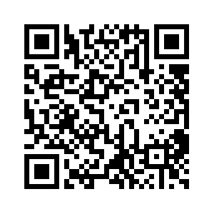

# Neural Networks for the Benchmarking of Detection Algorithms

**Student:** Silvia Miramontes (Lawrence Berkeley National Laboratory; University of California, Berkeley) 
**Supervisor:** Daniela Ushizima (Lawrence Berkeley National Laboratory; University of California, Berkeley) 

**Abstract:** There are several automated methods to detect objects from grayscale images. However, materials scientists still lack basic tools to compare different detection results, particularly when working with microtomography. This poster introduces FibCAM, a convolutional neural network (CNN)-based method using TensorFlow that allows benchmarking fiber detection algorithms. Our contribution is three-fold: (a) the design of a computational framework to compare automated fiber detection models with curated datasets through classification; (b) lossless data reduction by embedding prior knowledge into data-driven models; (c) a scheme to decompose computation into embarrassingly parallel processes for future analysis at scale. Our results show how FibCAM classifies different structures, and how it illustrates the material's composition and frequency distribution of microstructures for improved interpretability of machine learning models. The proposed algorithms support probing the specimen content from gigabyte-sized volumes and enable pinpointing inconsistencies between real structures known a priori and results derived from automated detections. 

